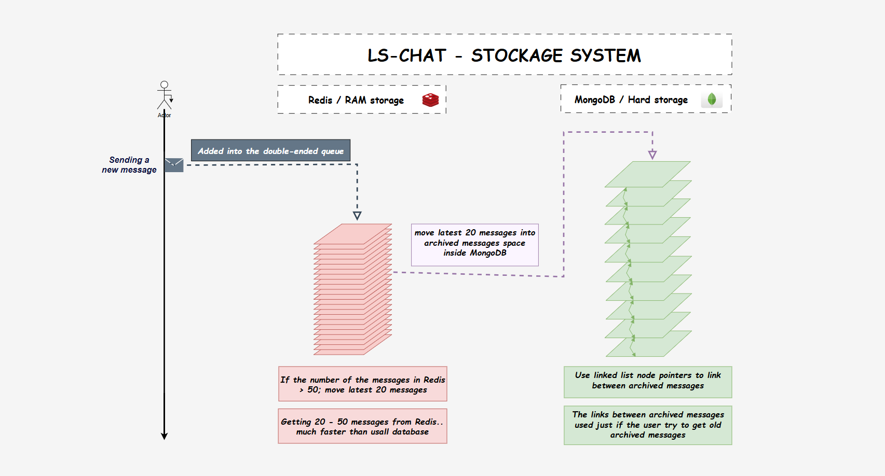
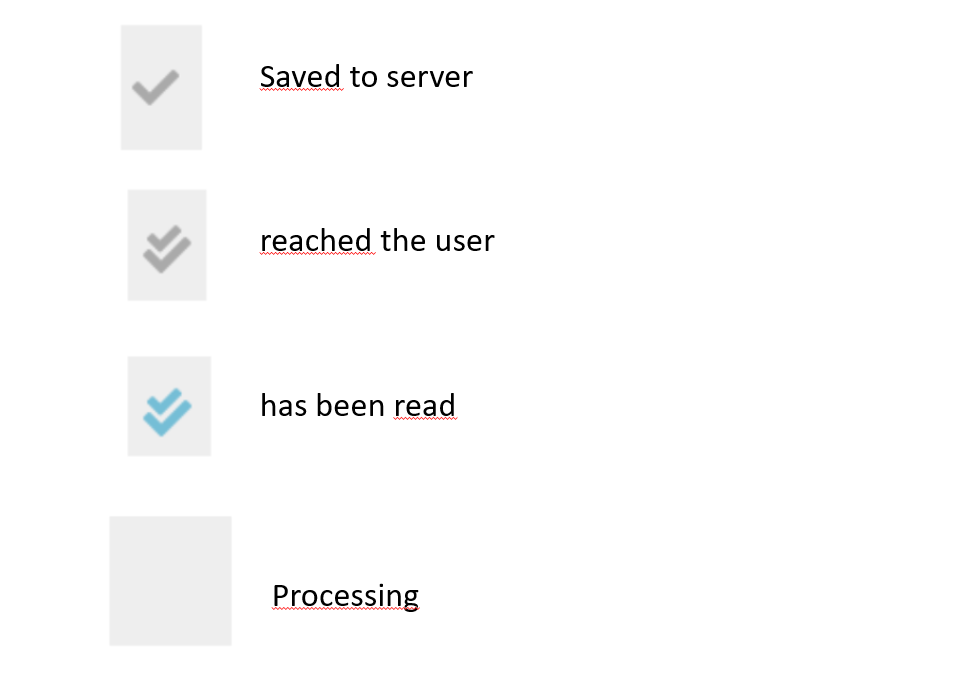

# LS-Chat

LS-Chat it's an acronym for the: *live support chat*

# technologies:
* front end: **React**
* back-end: **nodeJs, Redis, Socket.io**
* Databases: **MongoDB**, and **Redis** for caching.

# Features
* Live chat app, between admins and clients.
* Caching of the last 20 - 50 messages inside Redis for every user.
* Getting the latest messages from the RAM/Redis (faster X10).
* Old historic messages saved into mongoDB (non-relational database), those old messages are not loaded when the user/admin starts browsing the website; just when he scrolls up to get the historical/old messages.
* Create (use) many of admins / support multiple of webmasters.
* Know if the user is writing, before sending the messages.
* Support the messages statuses: if "The message saved into the server", "has been reached to the user", "has been seen by the user", or "nothing yet".

# Explanations:
* New messages are saved in a Redis "double-ended queue".
* Getting the messages from the RAM makes this method faster. (RAM X10 better)
* We moved a patch of 30 oldest messages into MongoDB, if the number of these messages in the RAM is bigger than 50.
* Every new message DOC has an ID pointer to the previous message DOC.
* When the user tries to get the next oldest messages (go to the top of the messages box), we know exactly the uid of the (next and previous) doc.
  => So getting the oldest messages always has O(1) time complexity.

# API's

[link of client API of LS-Chat](./api.http)

# Database diagram (MongoDB)

# Screenshots:
### The client service

### The admin service

### The login service

# Status of check of messages

