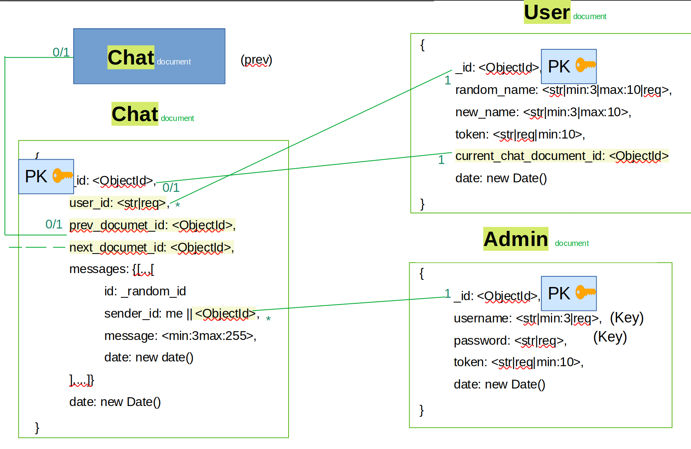
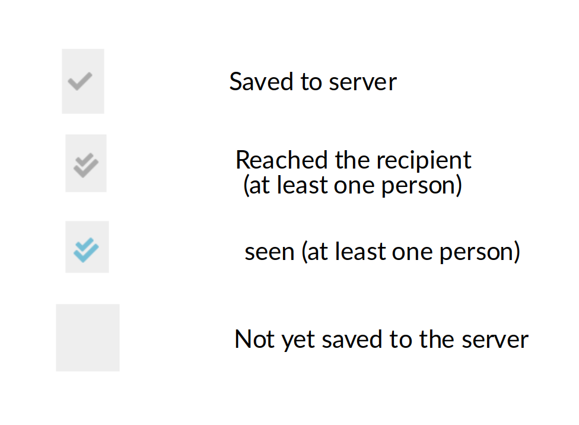
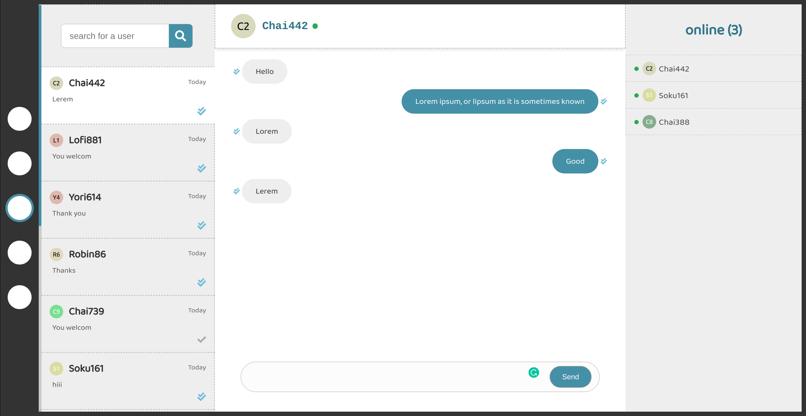
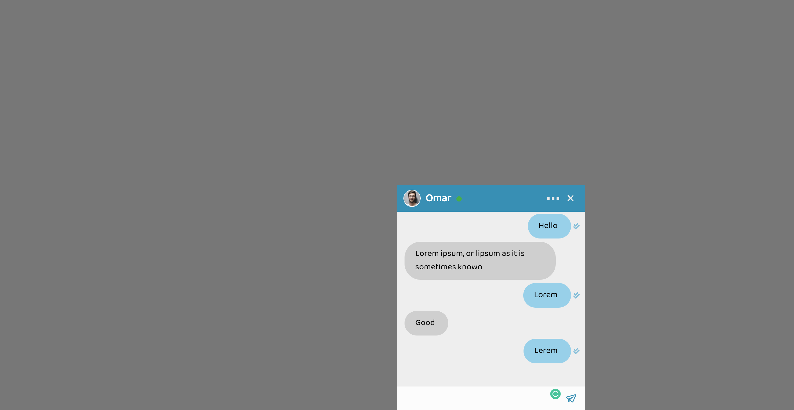
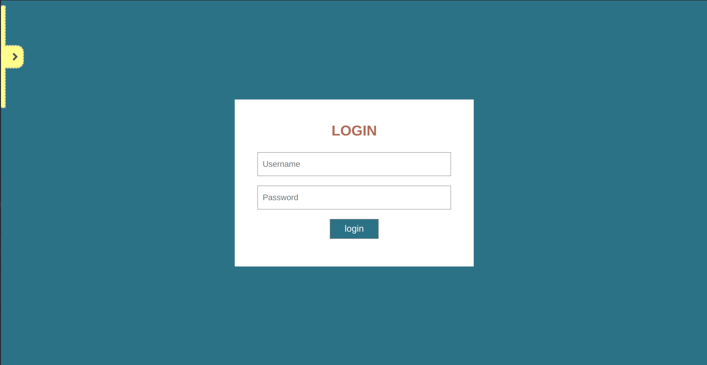

# LS-Chat

LS-Chat it's an acronym for the live support chat

* front end: using the **React**
* back-end: using **nodeJs, Redis, Socket.io**
* Databases: **MongoDB**, and **Redis** for caching.

# Features
* Live chat between admins and clients.
* Caching of last 20 - 50 messages in Redis for every user.
* Getting the latest messages from the RAM (faster X10).
* Old historic messages saved into mongoDB (non-relational database)
* Create (use) many of admins / support multiple of webmasters.
* Now how to write before sending the messages.
* Support: "The message reached the server", "has been reached to the user" and "has been read" statuses.

# Explanations:
* New messages are saved in a Redis "double-ended queue".
* Getting the messages from the RAM makes this method faster. (RAM X10 better)
* We moved a patch of 30 oldest messages into MongoDB, if the number of these messages in the RAM is bigger than 50.
* Every new message DOC has an ID pointer to the previous message DOC.
* When the user tries to get the next oldest messages (go to the top of the messages box), we know exactly the uid of the (next and previous) doc.
  => So getting the oldest messages always has O(1) time compexity.

# API's

[link of client API of LS-Chat](./api.http)

# Database diagram (MongoDB)

# Status of check of messages

# photos

### The admin service

### The client service

### The login service

