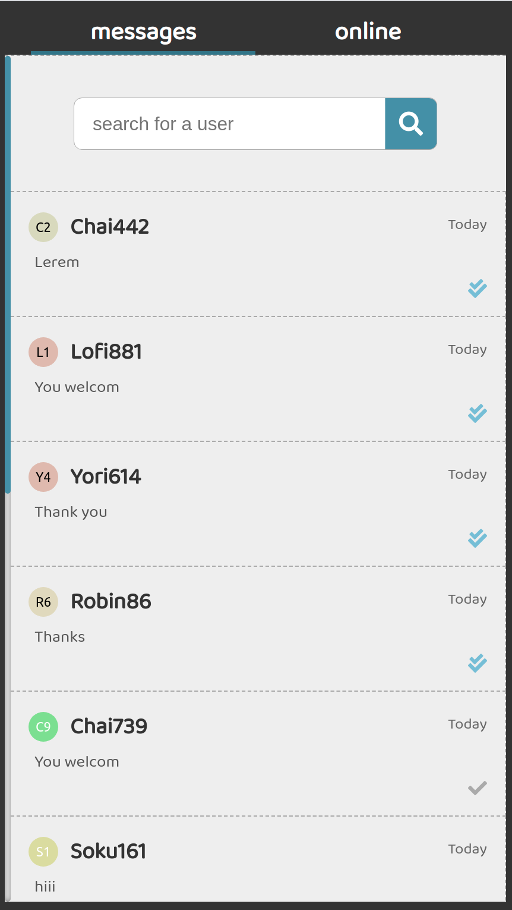

# LS-Chat

LS-Chat it's acronym for: the live support chat

* In the front-end we are using the **React**
* And in the back-end we are using the **nodeJs, Redis, Socket.io**
* Databases: the **MongoDB**, and the **Redis** for the caching.

# Features
* Live chat between admins and clients.
* We are using the redis for caching the session, the new message before complete it numbers 20msg, online users for the best practice (The fastest of the app)
* Create (use) many of admins.
* Find out who writes before his sent the first message.

# all client API

[link of client API of LS-Chat](./api.http)

# Database diagram (MongoDB)

# Status of check of messages

# photos

### The admin service

### The client service

### The login service

### When we visit the admin from a phone

